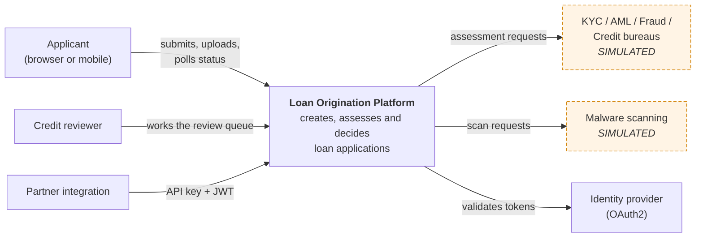
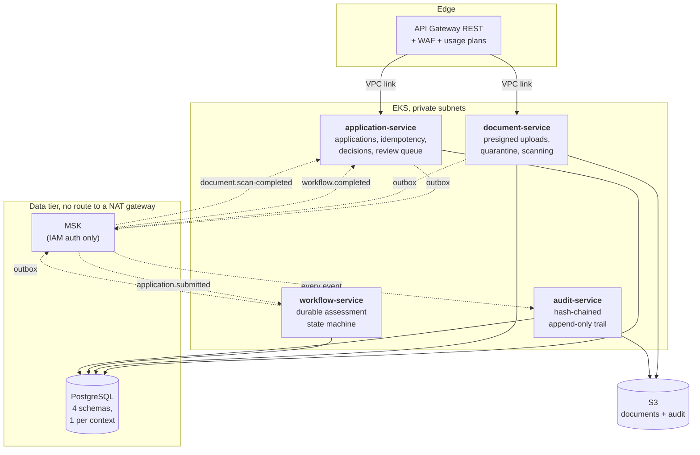
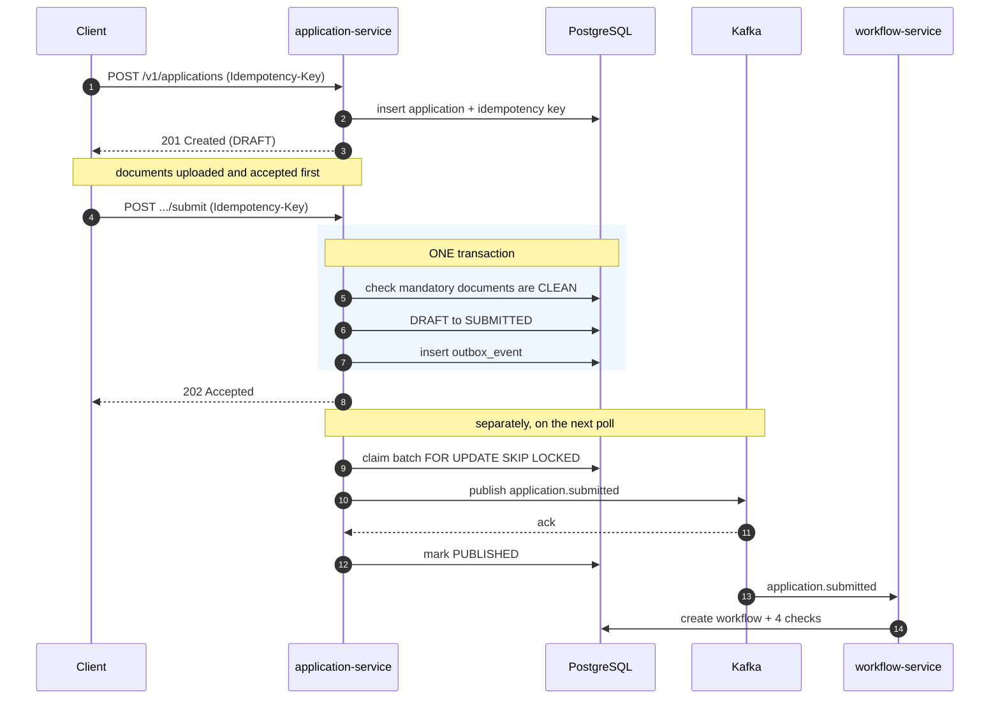
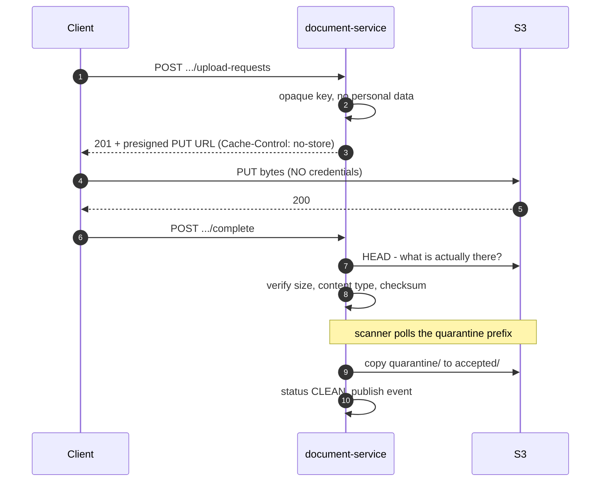
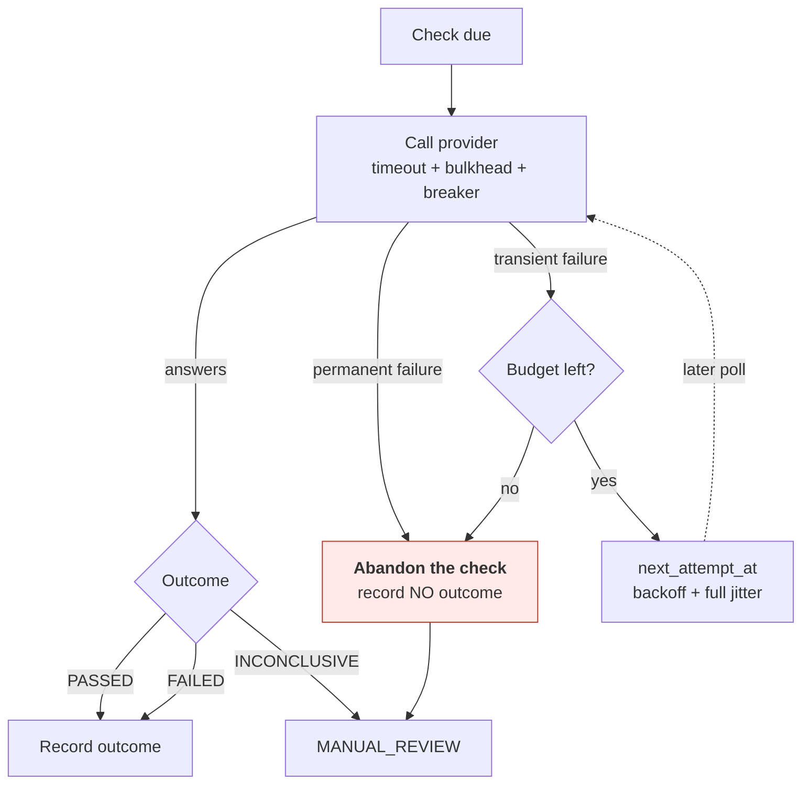
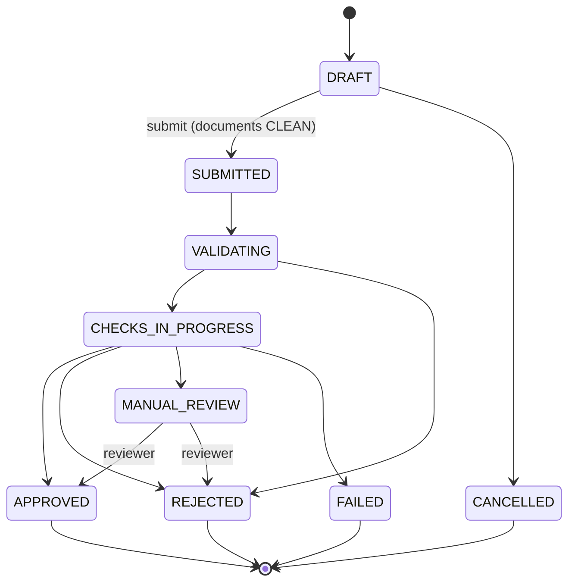
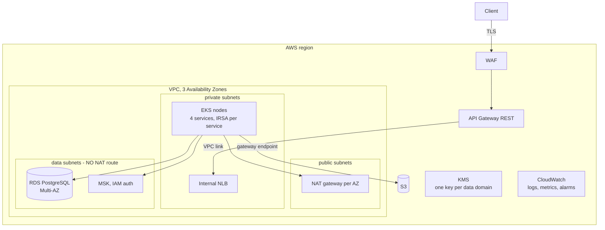
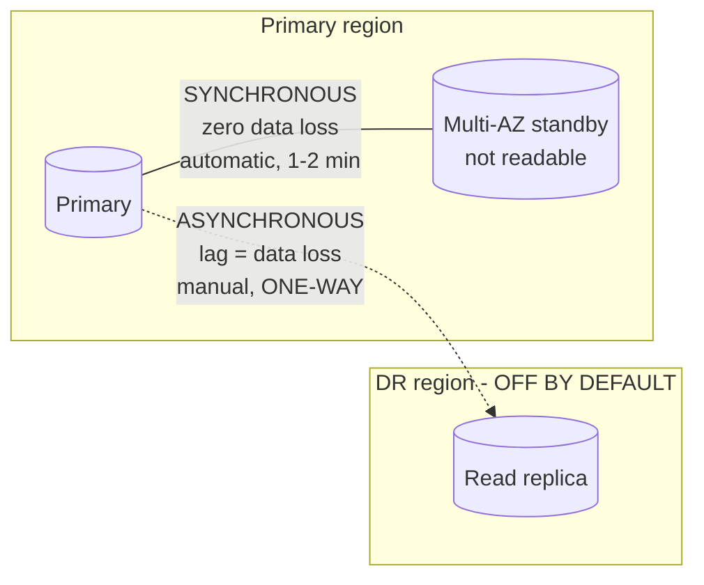

# AWS Loan Origination Platform

A production-oriented **reference implementation** of a cloud-native loan
origination platform: Java 25, Spring Boot 4, PostgreSQL, Kafka, and an AWS
target architecture expressed entirely in Terraform and Helm.

> **Nothing in this repository has been deployed.** No AWS resource has been
> created, no image has been pushed, no cluster has been contacted. Local Docker
> Compose is the default and only execution path. See
> [`docs/operations/cost.md`](docs/operations/cost.md) before running anything
> against a real account.

> **Simulated integrations are labelled as simulated.** KYC, AML, fraud, credit
> scoring and malware scanning are represented by ports with local simulators.
> No real financial or security service is contacted anywhere in this codebase.

See [`PROGRESS.md`](PROGRESS.md) for exactly what is implemented, what was
verified, and what is still missing. It is the authoritative status document;
this README describes the design.

---

## Quick start

```bash
make build          # compile + unit tests, no Docker required
make verify         # + integration tests (needs a running Docker daemon)
make local-up       # start PostgreSQL, Kafka, LocalStack and all four services
make local-smoke-test
make local-down     # stops the stack and KEEPS your data
make local-clean    # stops the stack and DELETES the local volumes
```

`make help` lists every target. No target in the Makefile creates, changes or
deletes an AWS resource.

---

## Architecture

### System context



The dashed boxes are simulations. Nothing in this repository contacts a real
bureau or a real scanner — see [ADR-0005](docs/adr/0005-simulated-external-checks.md)
and [ADR-0008](docs/adr/0008-simulated-malware-scanning.md).

### Containers



Solid lines are synchronous calls; dashed lines are events. **The four services
never call each other synchronously.** Everything between them goes through
Kafka, and everything reaching Kafka goes through an outbox
([ADR-0003](docs/adr/0003-transactional-outbox.md)).

### Submitting an application



The boxed step is the point of the whole design: the state change and the intent
to publish commit together, so neither can exist without the other. **The broker
is not in the request path** — an unavailable broker is not an unavailable API.

### Uploading a document



The bytes never pass through the platform's compute
([ADR-0011](docs/adr/0011-presigned-uploads.md)). The URL is a bearer credential:
never logged, never cached.

### When a check fails



**The red box is the most important behaviour in the platform.** An abandoned
check records *no* outcome, so "the bureau was down" can never later be read as
"the applicant failed" ([ADR-0007](docs/adr/0007-durable-workflow-state-machine.md)).

### Application states



Transitions are domain methods that refuse an illegal move, not setters. The full
9x9 matrix is tested. A reviewer deliberately **cannot** return an application to
`MANUAL_REVIEW`, which would let it loop with nobody owning it.

### AWS topology



The data tier has **no default route**. A database or a broker has no legitimate
reason to open an outbound connection, so removing the route removes an
exfiltration path entirely rather than relying on a rule someone could relax.

### High availability is not disaster recovery



Conflated often enough to be worth the diagram. **Neither is a backup**: both
replicate a mistaken `DELETE` as faithfully as a legitimate one. Backups and
point-in-time recovery protect against a mistake; these protect against
infrastructure failure. See
[the promotion runbook](docs/operations/runbooks/cross-region-replica-promotion.md).

---

## The decisions worth reading first

| Question | Answer |
|---|---|
| How does a state change never disagree with its event? | [ADR-0003](docs/adr/0003-transactional-outbox.md) — transactional outbox |
| How is a provider outage kept from looking like a rejection? | [ADR-0007](docs/adr/0007-durable-workflow-state-machine.md) — abandoned checks record no outcome |
| How would tampering with a decision be detected? | [ADR-0009](docs/adr/0009-hash-chained-append-only-audit-trail.md) — hash-chained, append-only |
| How do three services work without applicant personal data? | [ADR-0010](docs/adr/0010-pseudonymous-applicant-reference.md) — HMAC pseudonym, peppered from a file |
| Why is a retry safe? | [ADR-0012](docs/adr/0012-idempotency-keys.md) — canonical request fingerprints |
| How is the API contract kept honest? | [ADR-0016](docs/adr/0016-openapi-generated-from-the-code.md) — generated from the code, drift fails the build |
| Where is the database password? | [ADR-0017](docs/adr/0017-iam-database-authentication.md) — there isn't one; the pod's IAM role is the credential |

All seventeen are indexed in [`docs/adr/`](docs/adr/README.md).

---

## Documentation

Entries in *italics* do not exist yet; they are listed because files in the tree
already link to them, and `scripts/check-doc-links.sh` reports exactly which.

| Document | What it covers |
|---|---|
| [`PROGRESS.md`](PROGRESS.md) | Implementation status, verified commands, limitations — **the honest record** |
| [`SECURITY.md`](SECURITY.md) | Reporting a vulnerability, what protects the data, what is not scanned |
| [`CONTRIBUTING.md`](CONTRIBUTING.md) | How to work on this, and the rules that are not negotiable |
| [`docs/security/threat-model.md`](docs/security/threat-model.md) | STRIDE, with residual risks stated |
| [`docs/security/data-classification.md`](docs/security/data-classification.md) | What is held, how long, and the honest problem with erasure |
| [`docs/security/incident-response.md`](docs/security/incident-response.md) | Severity, playbooks, what is available to investigate with |
| [`docs/security/scanning.md`](docs/security/scanning.md) | Every scanner result and every suppression's justification |
| [`docs/api/openapi.yaml`](docs/api/openapi.yaml) | The OpenAPI 3.1 contract — **generated from the code**, and a test fails the build if it drifts |
| [`docs/operations/runbooks/secret-rotation.md`](docs/operations/runbooks/secret-rotation.md) | Rotate first, then consider history |
| [`infrastructure/terraform/README.md`](infrastructure/terraform/README.md) | Module inventory, cost warnings, HA vs DR |
| *`docs/adr/`* | Architecture decision records — Phase 12 |
| *`docs/architecture/`* | Context, containers, sequences, AWS topology — Phase 12 |
| *`docs/operations/cost.md`* | Cost drivers — Phase 12 |
| *`docs/public-release-checklist.md`* | What must happen before this is made public — Phase 12 |

## Continuous integration

Four workflows in [`.github/workflows/`](.github/workflows/), **none of which
has ever executed** — the repository has no remote. Every third-party action is
pinned to a commit SHA, enforced by
[`scripts/check-action-pins.sh`](scripts/check-action-pins.sh).

| Workflow | Trigger | What it will not do |
|---|---|---|
| `pull-request.yml` | PR, push to main | Hold an AWS credential, push an image, plan Terraform |
| `publish-images.yml` | release, or manual + literal `PUBLISH` | Run on a push |
| `terraform-plan.yml` | manual only | Apply — the file contains no `terraform apply` |
| `deploy.yml` | manual only | Deploy without a typed `DEPLOY`, a protected environment, and an immutable digest per service |

There is deliberately **no path from a merge to a deployment**.

---

## Licence

Apache License 2.0. See [`LICENSE`](LICENSE).
